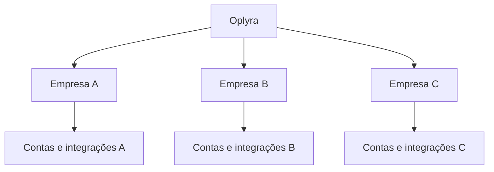
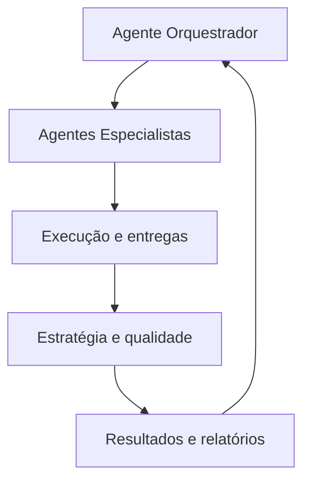
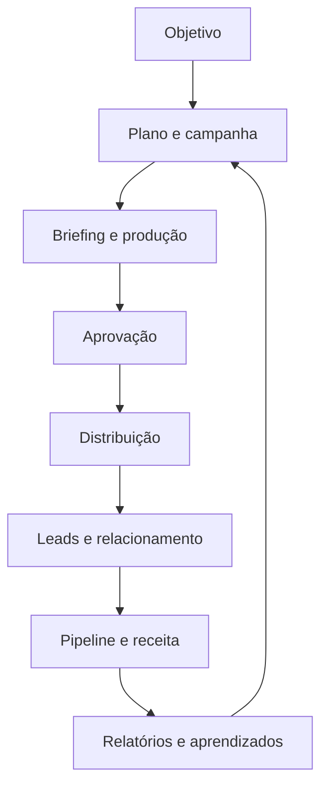

# Documento de Transição — Oplyra | Marketing Ops SaaS

> Documento autossuficiente para orientar a construção greenfield da Oplyra como uma nova plataforma SaaS, sem dependência, herança técnica ou acoplamento com sistemas preexistentes.

**Versão:** 2.2  
**Data:** 13 de setembro de 2026  
**Status:** Direção estratégica para novo produto comercial  
**Nome do produto:** `Oplyra`  
**Mercado inicial recomendado:** empresas SaaS B2B  
**Expansão futura:** outros segmentos B2B, mediante validação

**Revisão desta versão 2.2:** 13 de setembro de 2026 — correção do posicionamento de mercado para SaaS B2B, remoção de referências ao posicionamento anterior e incorporação da DEC-018. As decisões e evoluções funcionais da versão 2.1, incluindo a DEC-017, permanecem preservadas.

---

## Identidade oficial do produto

- **Marca:** Oplyra;
- **Domínio principal no Brasil:** `oplyra.com.br`;
- **Plataforma:** `app.oplyra.com.br`.

> **OPLYRA**  
> Sua operação de marketing, da estratégia à receita.

Oplyra é a marca comercial da plataforma de Marketing Operations descrita neste documento.

### Significado do nome Oplyra

**Oplyra** é um nome autoral construído a partir de dois conceitos:

- **Op**, de *Operations*: representa operação, execução, processos, tecnologia e gestão;
- **Lyra**, referência à lira e à ideia de harmonia e orquestração: representa diferentes frentes trabalhando de forma coordenada em torno de um mesmo objetivo.

Juntos, esses conceitos traduzem a essência da marca:

> **Oplyra é a inteligência que orquestra toda a operação de marketing, conectando estratégia, execução e receita.**

O nome não limita a plataforma à criação de conteúdo, mídia paga ou inteligência artificial. Ele representa um sistema capaz de coordenar planejamento, campanhas, conteúdo, canais, automações, relacionamento, dados comerciais e resultados.

**Pronúncia recomendada:** O-plí-ra.

---

## 1. Decisão estratégica: produto greenfield

A Oplyra deverá nascer como uma **plataforma SaaS multiempresa, comercializável, independente e construída do zero**.

O projeto não será módulo, extensão, fork ou evolução de qualquer CRM ou sistema preexistente. A implementação não deverá reutilizar automaticamente:

- banco de dados ou migrations de outros produtos;
- autenticação, usuários ou permissões de outros sistemas;
- rotas, componentes, telas ou menus existentes;
- regras de negócio ou serviços internos de terceiros;
- credenciais, storage, filas ou infraestrutura compartilhada;
- nomes de tabelas, contratos de API ou decisões arquiteturais não validadas para a Oplyra.

A plataforma deverá possuir arquitetura, código, infraestrutura, autenticação, banco de dados, design system, observabilidade e ciclo de deploy próprios. Ela poderá se integrar, por contratos explícitos e desacoplados:

- a CRMs e sistemas comerciais dos clientes;
- a plataformas de anúncios;
- a provedores de e-mail;
- a redes sociais;
- a ferramentas de automação;
- a fontes de dados comerciais.

### Consequência da decisão

Toda integração externa deverá acontecer por APIs, webhooks, importações controladas ou conectores implementados atrás de interfaces/adapters. Nenhuma integração poderá definir o modelo interno do domínio ou tornar-se dependência estrutural da plataforma.

---

## 2. Origem da lógica do produto

O projeto nasceu da análise de uma proposta de assessoria de marketing da V4 Company com dois escopos recorrentes:

### Escopo apresentado no plano de referência de R$ 5.200

- gestor de mídia paga;
- Google Ads e Meta Ads;
- designer gráfico;
- copywriter/redator publicitário;
- gestor de projetos/Account;
- acompanhamento estratégico;
- check-ins semanais e mensais;
- análise de resultados, objetivos, premissas, riscos e entregas.

### Escopo adicional apresentado no plano de referência de R$ 7.400

Tudo do escopo anterior, acrescido de:

- réguas de relacionamento;
- sequência automatizada de interações;
- social media;
- duas postagens semanais no Instagram.

### O que será preservado

Os valores de R$ 5.200 e R$ 7.400 não serão copiados como preço da plataforma. Eles servem apenas para demonstrar que existem **dois níveis claros de escopo operacional**:

1. uma operação focada em estratégia, campanhas, mídia, criação e gestão;
2. uma operação completa, que também inclui relacionamento, automações, e-mail e redes sociais.

Essa diferença será transformada nos dois planos comerciais da Oplyra.

---

## 3. Tese do produto

### Problema

Empresas operam marketing por meio de ferramentas fragmentadas, profissionais separados e informações que raramente chegam de forma confiável até vendas e receita.

É comum existir:

- calendário em uma ferramenta;
- mídia paga diretamente nas plataformas;
- peças espalhadas em pastas;
- e-mail em outro sistema;
- automações no n8n ou em ferramentas distintas;
- dados comerciais no CRM;
- relatórios produzidos manualmente;
- decisões baseadas em métricas de vaidade ou dados incompletos.

### Proposta

O Marketing Ops conecta estratégia, execução, distribuição, relacionamento e resultado comercial dentro de uma única operação assistida por inteligência artificial.

### Promessa conceitual

> Planeje, execute, automatize e acompanhe sua operação de marketing até a receita.

### Princípio de produto: partir do problema e aprender até a receita

**O cliente não acorda querendo comprar um software. Ele parte de uma situação concreta, de uma dor, de um risco ou de um resultado que deseja alcançar.** A Oplyra deverá orientar as campanhas dos seus tenants pelo contexto do público antes de apresentar o produto ou suas funcionalidades. Esse princípio vale para os produtos e ofertas de cada cliente, não apenas para a comunicação comercial da própria Oplyra.

Toda campanha deverá estruturar o raciocínio:

`Situação → Dor → Consequência → Desejo → Mecanismo → Prova → Oferta → Hipótese de teste → Variações`.

O mecanismo explica como a solução conduz do estado atual ao desejado; a prova sustenta a promessa com evidência autorizada; a oferta define o próximo passo e suas condições. A estrutura orienta o briefing, sem obrigar que cada peça contenha todas as etapas ou use uma fórmula textual rígida. A mensagem deve considerar jornada, objeções e nível de consciência do público.

Variações A/B deverão testar hipóteses explícitas sobre ângulo, dor, motivação, hook, prova, visual, CTA ou outro elemento relevante. Mudanças cosméticas sem pergunta de aprendizado não caracterizam, por si, um experimento. Um teste visual é válido quando explicita por que a mudança pode alterar o resultado.

O ciclo obrigatório será **Entender → Hipotetizar → Criar → Testar → Medir → Aprender → Iterar**. A avaliação deve priorizar lead qualificado, reunião, proposta, contrato e receita quando disponíveis e adequados ao objetivo. CTR e CPL continuam úteis como diagnóstico ou indicadores provisórios, sem serem tratados como comprovação de resultado comercial.

### O que o produto não deve ser

- apenas um gerador de posts;
- apenas uma agenda de conteúdo;
- apenas um painel de anúncios;
- apenas uma ferramenta de e-mail;
- uma agência tradicional transformada em software;
- um gerador nativo de vídeo no escopo inicial;
- um sistema que promete substituir integralmente decisões humanas;
- um CRM genérico.

---

## 4. Modelo de entrega: plataforma e Service as a Software

O produto pode operar em dois modos comerciais complementares.

### SaaS assistido

O cliente utiliza a plataforma, a IA e as automações, mantendo sua própria equipe responsável pela aprovação e execução.

### Service as a Software

A plataforma executa grande parte do trabalho operacional e pode ser acompanhada por especialistas, parceiros ou equipe da própria operação comercial.

O sistema deve permitir que o mesmo produto atenda:

- empresas com equipe própria;
- empresas sem equipe completa;
- agências que operam múltiplos clientes;
- consultores e parceiros;
- operações internas de grupos empresariais.

### Princípio comercial

Não vender horas de designer, copywriter, gestor de tráfego ou Account. Vender **capacidade operacional, automação, governança e inteligência**, com serviços humanos opcionais e claramente separados.

---

## 5. Os dois planos de produto

Nomes provisórios:

1. **Oplyra Performance** — inspirado no escopo de R$ 5.200;
2. **Oplyra Growth** — inspirado no escopo de R$ 7.400.

Os nomes e preços poderão mudar após validação comercial. A diferença funcional deve permanecer clara.

## 5.1 Plano Oplyra Performance

Indicado para empresas que precisam organizar estratégia, campanhas, criação e mídia paga com acompanhamento de performance.

### Escopo funcional

- workspace da empresa;
- usuários, equipes e permissões;
- central estratégica;
- objetivos, metas e indicadores;
- Agente Orquestrador;
- Agente Account e Gestão de Projetos;
- Agente de Mídia Paga;
- Agente de Copywriting;
- Agente de Design;
- Agente de Estratégia e Qualidade;
- Agente de Performance e Inteligência;
- Agente de Relatórios e Check-ins;
- campanhas;
- briefing estruturado;
- produção de copy por agente especializado;
- análise assistida de ativos enviados pelo cliente, incluindo vídeos, para gerar copy, roteiros, transcrições, variações e configuração de campanha;
- direção e briefing visual por agente especializado;
- biblioteca de ativos;
- fluxo de produção e aprovação;
- gestão de projetos e responsáveis;
- Meta Ads;
- Google Ads;
- acompanhamento de orçamento;
- dashboard de performance;
- alertas e recomendações;
- check-in semanal automático;
- relatório mensal automático;
- registro de hipóteses, riscos, entregas e decisões;
- integração básica com CRM para leads e conversões;
- atribuição básica por first touch e last touch.

### Experimentos no Performance

Briefing orientado por problema, matriz de hipóteses criativas, registro de testes A/B de campanha e aprendizado fazem parte do núcleo Performance e são herdados pelo Growth. A execução integrada dos testes acompanha o roadmap e as capacidades das APIs. A menção a testes A/B nos adicionais Growth refere-se à extensão para e-mail e demais canais contratados.

### Tradução dos profissionais da proposta para a plataforma

| Papel da assessoria | Capacidade do sistema |
|---|---|
| Account/Gestor de Projetos | Agente Account para planejamento, tarefas, responsáveis, prazos, aprovações, riscos e status |
| Gestor de Tráfego | Agente de Mídia Paga para análise, alertas, recomendações, rascunhos e execução controlada |
| Designer Gráfico | Agente de Design para conceito, briefing visual, variações estáticas assistidas e consistência de marca; vídeo pode ser analisado como ativo, mas não renderizado nativamente no escopo inicial |
| Copywriter | Agente de Copywriting para variações, revisão de marca, CTAs, anúncios, roteiros e versionamento, inclusive a partir da análise de vídeos e outros ativos enviados pelo cliente |
| Acompanhamento estratégico | Agente de Estratégia e Qualidade independente dos agentes executores |
| Check-ins e análise | Agentes de Performance e Relatórios acionados por workflows agendados |

### Limites conceituais

O plano Performance não inclui, como módulos completos:

- jornadas de relacionamento;
- automações multietapas;
- e-mail marketing em massa;
- agenda e publicação orgânica multicanal;
- gestão completa de social media;
- atribuição avançada multicanal.

Esses recursos pertencem ao plano Growth.

## 5.2 Plano Oplyra Growth

Indicado para empresas que desejam uma operação de marketing integrada, cobrindo aquisição, conteúdo, relacionamento e acompanhamento até vendas.

### Inclui tudo do Performance, mais

- planejamento editorial;
- agenda de conteúdo;
- Kanban de produção;
- publicação e distribuição orgânica, conforme APIs disponíveis;
- gestão de social media;
- adaptação de conteúdo por canal;
- campanhas de e-mail;
- templates e segmentos;
- testes A/B;
- réguas de relacionamento;
- automações baseadas em eventos;
- tarefas automáticas para equipes;
- webhooks e integração com n8n;
- nutrição de leads;
- reativação de oportunidades;
- relacionamento com clientes;
- controle de frequência e consentimento;
- atribuição avançada;
- visão integrada de conteúdo, mídia, relacionamento, pipeline e receita;
- recomendações cross-channel;
- relatórios executivos completos.
- Agente de Social Media;
- Agente de E-mail Marketing;
- Agente de Lifecycle;
- Agente de Revenue Intelligence.

### Tradução dos adicionais da proposta

| Adicional da assessoria | Capacidade do plano Growth |
|---|---|
| Réguas de relacionamento | Jornadas versionadas com gatilhos, condições, esperas, e-mails, tarefas, notificações e webhooks |
| Social Media | Planejamento editorial, agenda, produção, aprovação, publicação, métricas e reaproveitamento de conteúdo |
| Duas postagens por semana | Não vira uma regra fixa; vira capacidade de operação recorrente, sujeita aos limites comerciais do plano |

---

## 6. Matriz comparativa dos planos

| Capacidade | Performance | Growth |
|---|:---:|:---:|
| Orquestrador multiagentes | ✓ | ✓ |
| Agentes Account, Mídia, Copy e Design | ✓ | ✓ |
| Agente de Estratégia e Qualidade | ✓ | ✓ |
| Agentes de Performance e Relatórios | ✓ | ✓ |
| Estratégia e objetivos | ✓ | ✓ |
| Campanhas | ✓ | ✓ |
| Hipóteses criativas e registro de testes A/B de campanha | ✓ | ✓ |
| Gestão de projetos | ✓ | ✓ |
| Copiloto de copy | ✓ | ✓ |
| Análise de imagens e vídeos enviados pelo cliente | ✓ | ✓ |
| Geração/renderização nativa de vídeo | — | — |
| Briefing e ativos visuais | ✓ | ✓ |
| Aprovações | ✓ | ✓ |
| Meta Ads | ✓ | ✓ |
| Google Ads | ✓ | ✓ |
| Dashboard de aquisição | ✓ | ✓ |
| Check-ins semanais e mensais | ✓ | ✓ |
| Integração básica com CRM | ✓ | ✓ |
| Atribuição first/last touch | ✓ | ✓ |
| Planejamento editorial | — | ✓ |
| Agenda de conteúdo | — | ✓ |
| Social media | — | ✓ |
| Publicação orgânica | — | ✓ |
| E-mail marketing | — | ✓ |
| Segmentos dinâmicos | — | ✓ |
| Testes A/B de e-mail | — | ✓ |
| Réguas de relacionamento | — | ✓ |
| Automações multietapas | — | ✓ |
| Nutrição e reativação | — | ✓ |
| Atribuição avançada | — | ✓ |
| Visão cross-channel até receita | Parcial | ✓ |
| Agentes Social, E-mail e Lifecycle | — | ✓ |
| Agente de Revenue Intelligence | — | ✓ |

---

## 7. Definição dos planos em JSON

Este JSON representa direitos funcionais. Limites numéricos devem permanecer configuráveis no sistema comercial.

```json
{
  "plans": [
    {
      "id": "performance",
      "name": "Oplyra Performance",
      "referenceScope": "v4_5200_scope",
      "positioning": "Estratégia, criação, mídia e gestão de performance.",
      "entitlements": {
        "strategyWorkspace": true,
        "agentOrchestrator": true,
        "accountAgent": true,
        "paidMediaAgent": true,
        "copywritingAgent": true,
        "designAgent": true,
        "strategyQualityAgent": true,
        "performanceIntelligenceAgent": true,
        "reportingCheckinAgent": true,
        "objectivesAndKpis": true,
        "campaignManagement": true,
        "creativeExperiments": true,
        "projectManagement": true,
        "copyCopilot": true,
        "mediaAssetAnalysis": true,
        "videoAssetInput": true,
        "nativeVideoGeneration": false,
        "visualBriefCopilot": true,
        "assetLibrary": true,
        "approvalWorkflow": true,
        "metaAds": true,
        "googleAds": true,
        "weeklyCheckin": true,
        "monthlyReport": true,
        "basicCrmIntegration": true,
        "basicAttribution": true,
        "contentCalendar": false,
        "organicSocial": false,
        "emailMarketing": false,
        "relationshipJourneys": false,
        "advancedAutomations": false,
        "advancedAttribution": false
      },
      "limits": {
        "users": "configurable",
        "adAccounts": "configurable",
        "aiCredits": "configurable",
        "mediaProcessingMinutes": "configurable",
        "storageGb": "configurable",
        "crmConnections": "configurable"
      }
    },
    {
      "id": "growth",
      "name": "Oplyra Growth",
      "referenceScope": "v4_7400_scope",
      "positioning": "Operação completa de aquisição, conteúdo, relacionamento e receita.",
      "inherits": "performance",
      "entitlements": {
        "contentCalendar": true,
        "socialMediaAgent": true,
        "emailMarketingAgent": true,
        "lifecycleAgent": true,
        "revenueIntelligenceAgent": true,
        "organicSocial": true,
        "channelAdaptation": true,
        "emailMarketing": true,
        "dynamicSegments": true,
        "emailAbTesting": true,
        "relationshipJourneys": true,
        "advancedAutomations": true,
        "nurtureAndReactivation": true,
        "webhooks": true,
        "advancedAttribution": true,
        "crossChannelReporting": true
      },
      "limits": {
        "users": "configurable",
        "adAccounts": "configurable",
        "socialAccounts": "configurable",
        "monthlyEmails": "configurable",
        "activeAutomations": "configurable",
        "aiCredits": "configurable",
        "mediaProcessingMinutes": "configurable",
        "storageGb": "configurable",
        "crmConnections": "configurable"
      }
    }
  ]
}
```

---

## 8. Regra importante de empacotamento

Não condicionar a arquitetura do produto diretamente aos planos.

O sistema deve possuir capacidades modulares e um serviço de entitlements que decide o que cada assinatura pode acessar.

### Evitar

```text
if (plan === "growth") {
  // regra de negócio espalhada pela aplicação
}
```

### Preferir

```text
entitlements.can(tenantId, "relationshipJourneys")
```

Isso permitirá:

- mudar os planos sem refatorar a aplicação;
- criar add-ons;
- conceder testes;
- criar planos personalizados;
- atender parceiros;
- alterar limites sem deploy;
- oferecer recursos beta.

---

## 9. Públicos prioritários

### Mercado inicial recomendado

Empresas SaaS B2B com operação de marketing conectada a aquisição, geração de demanda, pipeline comercial e receita recorrente.

### Por que começar verticalizado

- concentra o discovery em um modelo de negócio e uma linguagem comercial coerentes;
- permite validar o vínculo entre campanhas, leads qualificados, reuniões, oportunidades, contratos e receita recorrente;
- favorece experimentos com ciclos de aquisição, trial, demonstração, venda consultiva e expansão, conforme o modelo de cada tenant;
- reduz a amplitude do MVP sem criar dependência técnica de um fornecedor ou subsegmento específico;
- facilita a criação de templates, indicadores e jornadas próprios de Marketing Ops para SaaS B2B.

### Expansão

A arquitetura deve continuar agnóstica de segmento, mas o produto inicial deve priorizar:

- templates para SaaS B2B;
- indicadores de aquisição, pipeline e receita recorrente;
- integrações com o ecossistema comercial e de marketing usado por empresas SaaS;
- campanhas e jornadas prontas para contextos SaaS B2B;
- linguagem comercial compatível com geração de demanda, vendas B2B e receita recorrente.

---

## 10. Arquitetura multi-tenant

Cada empresa deverá possuir ambiente isolado.



### Requisitos obrigatórios

- organizações/tenants;
- memberships;
- usuários com múltiplos tenants;
- papéis e permissões;
- isolamento no banco;
- isolamento no storage;
- credenciais por tenant;
- configurações e branding por tenant;
- assinatura, plano e limites;
- consumo de IA por tenant;
- auditoria;
- suporte com acesso temporário, explícito e auditado;
- exportação e exclusão de dados;
- políticas LGPD;
- possibilidade futura de agências gerenciarem clientes.

### Contexto mínimo do tenant

```json
{
  "tenant": {
    "id": "uuid",
    "name": "Empresa Exemplo",
    "slug": "empresa-exemplo",
    "status": "trial|active|past_due|suspended|cancelled",
    "planId": "performance|growth|custom",
    "timezone": "America/Sao_Paulo",
    "locale": "pt-BR",
    "currency": "BRL",
    "brandProfileId": "uuid",
    "subscriptionId": "uuid|null",
    "createdAt": "ISO-8601"
  }
}
```

---

## 11. Brand OS por empresa

Cada tenant terá um conjunto de regras de marca usado por pessoas e IA.

### Conteúdo do Brand OS

- posicionamento;
- manifesto;
- tese central;
- público;
- produtos;
- estágio real de cada produto;
- tom de voz;
- pilares editoriais;
- palavras preferidas;
- palavras proibidas;
- afirmações autorizadas;
- claims que exigem evidência;
- concorrentes;
- referências;
- formatos e templates;
- critérios de aprovação.

### Aprendizado incorporado ao Brand OS

Resultados de experimentos deverão gerar propostas rastreáveis de atualização de personas, dores, objeções, mensagens, provas e frameworks narrativos. Cada proposta deve indicar experimento de origem, público/contexto, período, evidência, limitações e confiança. Estratégia e Qualidade revisa sua incorporação conforme governança do tenant, preservando histórico e versões anteriores. Um resultado local não vira regra universal de marca, e uma hipótese inconclusiva não vira fato ou claim autorizado.

### Regra de isolamento de marca

Manifestos, produtos, personas, campanhas, pipelines e linguagens pertencem exclusivamente ao tenant que os cadastrou. Nenhum conteúdo específico de uma empresa poderá ser incorporado aos prompts globais ou reutilizado por outro cliente.

### Contrato conceitual

```json
{
  "brandProfile": {
    "id": "uuid",
    "tenantId": "uuid",
    "name": "Marca principal",
    "centralThesis": "string",
    "manifesto": "markdown",
    "voice": {
      "attributes": ["string"],
      "avoid": ["string"]
    },
    "pillars": ["string"],
    "narrativeFrameworks": ["uuid"],
    "productTruth": [
      {
        "productId": "uuid",
        "status": "available|beta|future|internal|discontinued",
        "allowedClaims": ["string"],
        "forbiddenClaims": ["string"]
      }
    ],
    "approvalChecklist": ["string"],
    "version": 1,
    "active": true
  }
}
```

---

## 12. Módulos da plataforma

## 12.1 Onboarding

- criar empresa;
- selecionar segmento;
- escolher plano;
- cadastrar marca;
- cadastrar produtos;
- definir objetivos;
- convidar equipe;
- conectar contas;
- importar contatos quando permitido;
- conectar uma fonte de dados comerciais, quando necessário;
- criar primeira campanha;
- checklist de ativação.

## 12.2 Central Estratégica

- objetivos;
- metas;
- produtos;
- personas;
- dores e objeções;
- jornada;
- canais;
- orçamento;
- campanhas prioritárias;
- Brand OS;
- hipóteses e experimentos.

A Central Estratégica deverá manter, por público e contexto:

- situação atual e gatilhos que tornam o problema relevante;
- dores percebidas e não percebidas, consequências operacionais/financeiras e estado desejado;
- objeções, nível de consciência, jornada, mecanismo de solução, provas disponíveis e oferta;
- fontes e evidências que sustentam o diagnóstico, separadas das inferências;
- matriz priorizada de hipóteses, resultados anteriores, lacunas e próximos experimentos.

O aprendizado de campanhas deve retroalimentar esse contexto e o Brand OS, com escopo por tenant e revisão das conclusões antes de incorporá-las à estratégia.

## 12.3 Campanhas

Unir em um mesmo contêiner:

- objetivo;
- público;
- produto;
- mensagem;
- conteúdo;
- anúncio;
- e-mail;
- automação;
- leads;
- oportunidades;
- investimento;
- receita.

### Briefing e matriz de hipóteses da campanha

Cada campanha deverá vincular objetivo de negócio, persona/contexto e a sequência situação, dor, consequência, desejo, mecanismo, prova e oferta. Campos ainda desconhecidos devem aparecer como lacunas a investigar; a IA não deve inventar dores comprovadas, números, depoimentos ou promessas.

Cada experimento deverá registrar, antes de iniciar:

- hipótese verificável: para qual público/contexto, qual mudança se espera que produza qual efeito e por quê;
- dimensão testada, variante de referência e alternativa, com versões de copy e ativos;
- público, canal, distribuição das variantes, orçamento, período e condições mantidas comparáveis;
- métrica primária de negócio, indicadores secundários e limites de custo/qualidade;
- fonte de dados, janela de conversão/atribuição e critérios de suficiência, encerramento e decisão;
- responsável, aprovações e vínculos com campanha e anúncios externos.

Exemplo de hipótese: “Para líderes de marketing de empresas SaaS B2B com dificuldade de conectar aquisição a pipeline, o ângulo de receita não atribuída gera mais oportunidades qualificadas do que o de produtividade operacional.” A pergunta central de A pode ser “Quanto da sua aquisição realmente vira pipeline e receita?” e a de B “Quanto tempo seu time perde consolidando a operação de marketing?”. Oferta, público, formato e demais condições devem permanecer comparáveis para investigar esse ângulo.

Quando o objetivo for isolar o efeito de uma dimensão, alterar uma variável por teste. Se múltiplos elementos mudarem, registrar que se compara um conjunto criativo e limitar a conclusão a esse conjunto. Comparações sem distribuição controlada devem ser identificadas como observacionais, sem atribuir causalidade indevida.

O resultado deverá registrar evidências, limitações, decisão e próximo passo, incluindo conclusão inconclusiva quando necessário. Não é obrigatório executar A/B em toda campanha; é obrigatório explicitar a hipótese quando um teste for proposto e manter o briefing orientado por problema em todas elas.

## 12.4 Gestão de Projetos

- tarefas;
- responsáveis;
- prazos;
- dependências;
- status;
- comentários;
- riscos;
- aprovações;
- histórico;
- check-ins.

## 12.5 Estúdio de Conteúdo com IA

- briefings;
- copy para anúncios;
- roteiros;
- e-mails;
- landing pages;
- variações;
- revisão de marca;
- claims e evidências;
- briefing visual;
- análise multimodal de ativos enviados pelo cliente, incluindo vídeos;
- transcrição, resumo e identificação de mensagens, cenas, produto, oferta e CTAs quando tecnicamente suportado;
- geração de copy, headlines, hooks, CTAs, legendas, roteiros derivados e variações com base no conteúdo real do ativo e no Brand OS;
- adaptação por canal no Growth;
- versionamento;
- aprovação.

### Produção criativa orientada por hipótese

Copy e briefing visual deverão derivar do contexto estratégico e da hipótese aprovada. A matriz de produção deve indicar o que muda entre variantes (dor, ângulo, hook, prova, visual ou CTA), o que permanece constante e o resultado esperado. Cada versão deve manter vínculo com campanha, experimento, hipótese, evidências e ativo de origem.

Estratégia e Qualidade verifica se a mensagem reconhece a realidade do público, conecta a solução ao desejo e sustenta mecanismo, prova e oferta no Brand OS e em fatos. Variantes não devem criar claims sem evidência nem apresentar capacidades futuras como disponíveis.

Para vídeos, hipóteses podem orientar copies, hooks textuais, CTAs, roteiros derivados ou a seleção de ativos existentes. Comparar vídeos diferentes significa comparar os ativos ou conjuntos selecionados; não pressupõe geração, edição ou renderização nativa. As regras de vídeo abaixo permanecem integralmente aplicáveis.

### 12.5.1 Regra de vídeo como ativo de entrada

A Oplyra **não deverá gerar, editar ou renderizar arquivos de vídeo nativamente no escopo inicial**. Vídeos serão tratados como ativos enviados ou selecionados pelo cliente para análise, criação de materiais derivados, configuração de campanhas e distribuição pelos canais integrados.

Fluxo conceitual:

`Solicitação de campanha em vídeo → seleção/upload do vídeo → validação e armazenamento isolado → análise multimodal → copy e configuração da campanha → quality gate → aprovação → criação/publicação no canal integrado → métricas e aprendizado`.

Regras:

- se o usuário solicitar uma campanha em vídeo e ainda não houver um ativo selecionado, a interface/agente deverá orientá-lo a enviar ou escolher um vídeo da Biblioteca de Ativos;
- o upload deverá ser associado desde a origem a `tenantId`, proprietário, permissões, campanha e finalidade quando conhecidas;
- análise, transcrição, frames temporários, embeddings, resumos, copies e demais derivados deverão manter o mesmo escopo de tenant e política de acesso do ativo de origem;
- nenhum vídeo, transcrição, frame ou derivado de um tenant poderá ser usado para enriquecer prompts, memória ou conteúdo de outro tenant;
- processamento multimodal deverá ocorrer por adapters substituíveis, com minimização de dados e retenção controlada de artefatos temporários;
- a plataforma poderá produzir transcrição, resumo, identificação de cenas/mensagens, sugestão de melhorias, copy, headline, CTA, legenda, roteiro derivado e variações, conforme capacidade do provedor utilizado;
- o usuário deverá declarar ou possuir permissão de uso do ativo para publicidade;
- a publicação de campanha com gasto seguirá permissões, limites de orçamento, aprovação humana ou política explícita, auditoria e idempotência;
- geração ou edição nativa de vídeo poderá existir futuramente por integração ou add-on, sem ser dependência do domínio central.

## 12.6 Biblioteca de Ativos

- imagens;
- vídeos;
- documentos;
- logos;
- templates;
- provas;
- fontes;
- permissões de uso;
- tags;
- versões;
- relacionamentos com campanhas;
- metadados técnicos de mídia;
- status de processamento;
- análises e derivados vinculados ao ativo de origem;
- propriedade, finalidade, consentimento/permissão de uso quando aplicável;
- isolamento de storage, processamento e acesso por tenant.

## 12.7 Mídia Paga

- Meta Ads;
- Google Ads;
- campanhas e anúncios;
- orçamento;
- métricas;
- normalização;
- alertas;
- recomendações;
- modo sugestão;
- modo rascunho;
- criação de anúncios a partir de ativos existentes da Biblioteca, incluindo vídeos;
- montagem de copy, criativo selecionado, público, objetivo, orçamento, período, posicionamentos e conversão;
- publicação/execução controlada por integração, quando suportada pela API e liberada pelo roadmap;
- aprovação humana ou execução por política conforme autonomia do tenant;
- auditoria.

### Operação e avaliação dos testes de mídia

Mídia Paga deverá transformar a hipótese em plano de distribuição, preservar as condições de comparação e mapear variantes para os anúncios e resultados externos. Recursos de teste nativos serão usados quando suportados; limitações de entrega, sobreposição de públicos, distribuição desigual e mudanças durante o teste devem ser registradas.

A métrica primária deve refletir o objetivo de negócio no estágio mais relevante que possa ser medido com qualidade: lead qualificado, reunião, proposta, contrato ou receita, incluindo custos por etapa quando calculáveis. CTR/CPL apoiam o diagnóstico, mas não justificam declarar um vencedor comercial se a qualidade ou a conversão posterior contradisser essa leitura. Sem dados comerciais suficientes, o resultado deve ser rotulado como provisório ou inconclusivo e informar o indicador substituto utilizado.

Decisões devem considerar volume, janela de maturação comercial, investimento, qualidade dos dados e incerteza. Um contrato isolado não prova superioridade; ausência de dados não equivale a zero receita. Pausar, redistribuir verba ou publicar variantes continua sujeito a aprovação ou política explícita, limites e auditoria da DEC-016.

## 12.8 Conteúdo e Social Media — Growth

- calendário;
- lista;
- Kanban;
- canais;
- pauta;
- produção;
- aprovação;
- agendamento;
- publicação;
- métricas;
- reaproveitamento;
- conteúdos derivados.

## 12.9 E-mail Marketing — Growth

- campanhas;
- templates;
- segmentos;
- personalização;
- testes;
- agendamento;
- filas;
- eventos;
- unsubscribe;
- suppression;
- bounce e complaint;
- métricas;
- atribuição.

## 12.10 Réguas e Automações — Growth

- eventos;
- gatilhos;
- condições;
- esperas;
- e-mails;
- tarefas;
- notificações;
- webhooks;
- tags;
- atualização de campos permitidos;
- versionamento;
- simulação;
- idempotência;
- histórico por contato.

## 12.11 Dashboard

- investimento;
- impressões;
- cliques;
- leads;
- leads qualificados;
- reuniões;
- propostas;
- contratos;
- receita;
- CPL;
- CPQL;
- CAC;
- ROAS;
- funil;
- performance por campanha;
- performance por canal;
- performance por produto;
- qualidade do lead;
- riscos;
- recomendações.

O dashboard deverá permitir acompanhar a cadeia `Criativo/variante → Clique → Lead → Lead qualificado → Reunião → Proposta → Contrato → Receita`, quando houver vínculo disponível. A comparação por experimento deve mostrar métrica primária, custos, denominadores, período, cobertura dos dados comerciais, maturação e status da atribuição, distinguindo ausência de dados de resultado zero.

## 12.12 Relatórios e check-ins

Relatório semanal e mensal com:

- resultados;
- objetivos;
- premissas;
- riscos;
- entregas;
- o que foi feito;
- o que será feito;
- decisões pendentes;
- recomendações;
- limitações dos dados.

---

Os relatórios deverão incluir hipóteses testadas, evidências por variante, conclusões sustentadas ou inconclusivas, limitações, decisões e próximos experimentos. Recomendações de atualização da Central Estratégica e do Brand OS devem indicar sua origem e revisão pendente.

---

## 13. IA como capacidade transversal

A IA não deve aparecer como um módulo isolado. Ela deve apoiar cada etapa.

### Aplicações

- Account digital;
- planejamento;
- briefing;
- redação;
- análise multimodal de imagens e vídeos enviados pelo cliente;
- transcrição e interpretação de ativos para geração de conteúdo e campanhas;
- revisão de marca;
- adaptação por canal;
- análise de mídia;
- geração de relatórios;
- detecção de anomalias;
- recomendação de testes;
- classificação de feedback comercial;
- análise de qualidade do lead;
- sugestão de automações.

### Modos de operação

```json
{
  "aiModes": {
    "suggest": "Recomenda e aguarda decisão humana.",
    "draft": "Cria rascunho editável e aguarda aprovação.",
    "execute": "Executa somente ações permitidas por regra, limite, permissão e auditoria."
  },
  "default": "suggest",
  "publicationDefault": "draft",
  "budgetDefault": "suggest"
}
```

### Princípios

- saída estruturada;
- prompts versionados;
- custo por tenant;
- modelos substituíveis;
- dados sensíveis minimizados;
- isolamento de contexto, arquivos, derivados e memória por tenant;
- processamento de mídia com retenção controlada e descarte de temporários;
- evidências citadas;
- fatos separados de inferências;
- nenhuma publicação irrestrita;
- nenhum aumento relevante de orçamento sem aprovação;
- logs de decisão e execução.

---

## 13.1 Arquitetura multiagentes

A Oplyra deverá nascer como uma plataforma **agentic e multiagentes**. Cada agente representa uma função especializada da operação de marketing e possui objetivo, contexto, ferramentas, permissões, entradas, saídas, métricas e limites próprios.

O produto não deverá ser uma coleção de chatbots independentes. Os agentes trabalharão sobre o mesmo contexto empresarial, coordenados por um orquestrador e submetidos a governança, quality gates, aprovação humana e auditoria.



### Catálogo inicial de agentes

| Agente | Papel operacional | Principais responsabilidades |
|---|---|---|
| Orquestrador | Diretor da operação | Transformar objetivos em planos, decompor trabalho, delegar, controlar dependências, prazos, aprovações e bloqueios |
| Account e Projetos | Account/Gestor de Projetos | Organizar tarefas, acompanhar entregas, registrar decisões, riscos, pendências e status da operação |
| Mídia Paga | Gestor de tráfego | Planejar, montar, monitorar e recomendar campanhas, públicos, orçamento, testes, pausas e redistribuições em Meta e Google; preparar e, quando autorizado, publicar anúncios usando ativos aprovados |
| Copywriting | Copywriter | Produzir e revisar anúncios, landing pages, roteiros, e-mails, mensagens, títulos, hooks e CTAs; analisar o conteúdo semântico de ativos aprovados, inclusive vídeos, para gerar copy aderente ao material real e ao Brand OS |
| Design | Diretor de criação assistido | Criar conceitos e briefings visuais, gerar variações estáticas quando suportadas, adaptar formatos e verificar consistência de marca; não renderizar vídeo nativamente no escopo inicial |
| Estratégia e Qualidade | Supervisor independente | Revisar alinhamento estratégico, Brand OS, coerência, evidências, riscos, critérios de aceite e qualidade das entregas |
| Performance e Inteligência | Analista de resultados | Comparar metas e resultados, diagnosticar funil, identificar anomalias, hipóteses, riscos e oportunidades |
| Relatórios e Check-ins | Analista executivo | Consolidar check-ins semanais e mensais, decisões pendentes, resultados e próximos passos |
| Social Media | Especialista Growth | Planejar calendário, adaptar conteúdo, acompanhar aprovação, publicação e desempenho orgânico |
| E-mail Marketing | Especialista Growth | Criar campanhas, segmentações, testes e análises de entregabilidade e conversão |
| Lifecycle | Especialista Growth | Criar réguas, nutrição, reativação, gatilhos e jornadas automatizadas |
| Revenue Intelligence | Especialista Growth | Conectar marketing, dados comerciais, pipeline e receita com atribuição avançada |

### Responsabilidades obrigatórias no ciclo de experimentação — DEC-017

As responsabilidades abaixo complementam o catálogo, preservando a segregação de funções e os limites de cada plano:

| Agente | Responsabilidade adicional |
|---|---|
| Orquestrador | Coordenar Entender, Hipotetizar, Criar, Testar, Medir, Aprender e Iterar; exigir vínculos entre contexto, hipótese, entrega e resultado |
| Account e Projetos | Registrar responsáveis, prazos, aprovações, critérios de encerramento e decisões dos testes |
| Copywriting | Traduzir situação, dor, consequência, desejo, mecanismo, prova e oferta em mensagens; produzir variantes com hipótese explícita |
| Design | Traduzir a hipótese em conceito e variantes visuais; registrar elementos alterados e constantes, respeitando a regra de vídeo |
| Mídia Paga | Preparar e operar experimentos conforme autorização, controlar distribuição, custos, comparabilidade e rastreamento das variantes |
| Estratégia e Qualidade | Revisar aderência ao problema/contexto, validade da hipótese, provas, desenho do teste e limites das conclusões; revisar propostas de atualização estratégica |
| Performance e Inteligência | Comparar variantes pela métrica primária e pelo funil disponível, avaliar suficiência/maturação e registrar aprendizados e próximos testes |
| Relatórios e Check-ins | Comunicar resultados, limitações, decisões e mudanças propostas em personas, dores, objeções, mensagem e Brand OS |
| Social Media | Aplicar hipóteses ao conteúdo orgânico e distinguir comparação observacional de teste controlado |
| E-mail Marketing | Testar hipóteses de assunto, mensagem, prova e CTA, respeitando entregabilidade e resultado comercial disponível |
| Lifecycle | Relacionar hipóteses de mensagem e jornada à progressão comercial e ao feedback recebido |
| Revenue Intelligence | Aprofundar a análise até receita e a atribuição avançada no Growth, sem impedir a leitura comercial básica no Performance |

As saídas estruturadas dos agentes devem carregar, quando aplicável, identificadores de campanha, experimento, hipótese e variantes, versões do contexto/Brand OS, evidências, limitações e recomendação. A aprovação de uma peça não equivale à confirmação de sua hipótese.

### Contexto compartilhado e especializado

Todos os agentes poderão consultar, conforme permissão:

- Brand OS, produtos, públicos e ofertas;
- objetivos, metas, orçamento e campanhas;
- canais, restrições, aprovações e indicadores;
- histórico de tarefas, decisões, experimentos e resultados;
- integrações e fontes de dados autorizadas pelo tenant;
- ativos e derivados pertencentes ao tenant, respeitando permissões, finalidade e campanha.

Cada agente também deverá possuir memória e instruções especializadas. O contexto deverá ser recuperado por tarefa, com minimização de dados, escopo por tenant e versionamento. Não enviar todo o histórico para todo agente indiscriminadamente.

### Contrato conceitual dos agentes

```json
{
  "agentDefinition": {
    "id": "uuid",
    "tenantId": "uuid|null",
    "key": "paid-media-agent",
    "name": "Agente de Mídia Paga",
    "version": 1,
    "objective": "string",
    "instructions": "markdown",
    "allowedTools": ["string"],
    "requiredContext": ["string"],
    "inputSchema": "json-schema",
    "outputSchema": "json-schema",
    "autonomyLevel": "recommend|draft|approval_required|policy_execute",
    "qualityGateAgentKey": "strategy-quality-agent",
    "active": true
  },
  "agentRun": {
    "id": "uuid",
    "tenantId": "uuid",
    "agentDefinitionId": "uuid",
    "taskId": "uuid|null",
    "trigger": "user|event|schedule|agent",
    "status": "queued|running|waiting_approval|completed|failed|cancelled",
    "input": {},
    "structuredOutput": {},
    "evidence": [],
    "model": "string",
    "tokenUsage": 0,
    "estimatedCost": 0,
    "startedAt": "ISO-8601",
    "finishedAt": "ISO-8601|null"
  }
}
```

### Orquestração e segregação de funções

- o Orquestrador delega e acompanha, mas não aprova irrestritamente o próprio trabalho;
- agentes especialistas produzem análises ou entregas estruturadas;
- o Agente de Estratégia e Qualidade revisa o trabalho de outros agentes;
- validações determinísticas verificam formato, campos, UTMs, links, orçamento, permissões, propriedade/uso do ativo e regras obrigatórias;
- ações externas críticas exigem aprovação humana ou política explícita; publicação de campanha, gasto e alteração relevante de orçamento devem registrar quem ou qual política autorizou a ação;
- toda delegação, revisão, aprovação e execução gera trilha de auditoria;
- falhas utilizam retry limitado, idempotência, dead-letter e escalonamento humano;
- custos, latência e qualidade são medidos por agente, tenant e fluxo.

### Níveis de autonomia

1. **Recomendar:** produz análise e aguarda decisão humana;
2. **Preparar:** cria rascunho editável;
3. **Executar com aprovação:** prepara a ação e só executa após autorização;
4. **Executar por política:** realiza ações de baixo risco dentro de limites aprovados.

O padrão inicial será `recommend` para orçamento e estratégia e `draft` para publicação e comunicação externa. Autonomia superior deverá ser liberada por ação, tenant e integração. Um tenant poderá, futuramente, definir políticas de execução com limites explícitos — por exemplo, autorizar publicação automática até determinado orçamento — sem conceder autonomia irrestrita.

### Check-ins e tarefas agendadas

Crons não deverão conter inteligência de negócio. Um scheduler persistente dispara workflows versionados e idempotentes, que coletam dados e acionam os agentes responsáveis.

- **Semanal:** resultados, entregas, tarefas atrasadas, riscos, decisões pendentes, recomendações e plano dos próximos sete dias;
- **Mensal:** metas versus resultados, investimento, receita, CAC, ROAS, conversões, aprendizados, hipóteses, riscos e plano do mês seguinte;
- o relatório deverá ser salvo no tenant antes de qualquer envio;
- o envio poderá ocorrer por dashboard e e-mail, respeitando destinatários, consentimento, timezone e preferências;
- falhas de coleta deverão aparecer como limitações, nunca ser preenchidas por suposição da IA.

### Separação entre fato, análise e recomendação

Toda análise dos agentes deverá classificar suas afirmações como:

- **fato:** comprovado pelos dados disponíveis;
- **inferência:** interpretação fundamentada;
- **hipótese:** explicação que ainda precisa ser testada;
- **recomendação:** ação proposta;
- **limitação:** dado ausente, parcial ou inconsistente.

---

## 14. Fluxo operacional completo



### Fluxo Performance

`Objetivo → Orquestração → Campanha → Copy/peça → Quality gate → Aprovação → Mídia paga → Leads → Dados comerciais → Resultado → Check-in`.

### Fluxo Growth

`Objetivo → Orquestração → Campanha → Conteúdo/anúncio/e-mail → Quality gate → Aprovação → Distribuição → Lead → Régua → Dados comerciais → Receita → Aprendizado cross-channel`.

---

### Ciclo de aprendizado que detalha os fluxos acima

1. **Entender:** recuperar objetivo, público, situação, dor, consequência, desejo, objeções e evidências na Central Estratégica.
2. **Hipotetizar:** definir mecanismo, prova, oferta, hipótese, variável, variantes, métrica e critérios de decisão.
3. **Criar:** produzir copy e briefing visual vinculados à hipótese; selecionar ativos e aplicar quality gate e aprovação.
4. **Testar:** distribuir as variantes dentro das permissões e do estágio do roadmap, registrando condições reais de execução.
5. **Medir:** conectar criativos a leads, qualificação, reuniões, propostas, contratos e receita disponíveis, com fonte e limites de atribuição.
6. **Aprender:** registrar conclusão, incerteza e feedback comercial; propor atualização de personas, dores, objeções, mensagem e Brand OS.
7. **Iterar:** incorporar alterações revisadas e priorizar o próximo experimento, preservando histórico.

O retorno dos relatórios ao plano/campanha inclui essa revisão do contexto estratégico. O ciclo vale para Performance e Growth, respeitando canais, atribuição e autonomia de cada etapa.

---

## 15. Atribuição e integrações comerciais

A Oplyra não deverá construir um CRM próprio dentro do produto. Quando o cliente desejar atribuição até receita, a plataforma receberá dados de sistemas comerciais externos por conectores desacoplados, APIs, webhooks ou importações controladas.

Deve criar uma camada de integração capaz de receber:

- contatos;
- leads;
- origem;
- etapa;
- reuniões;
- propostas;
- contratos;
- receita;
- perdas;
- feedback de qualidade.

### Níveis de atribuição

#### Performance

- first touch;
- last touch;
- UTM;
- campanha;
- canal;
- conversão básica.

#### Growth

- múltiplos touchpoints;
- conteúdo assistido;
- e-mail;
- automação;
- social;
- jornada até receita;
- modelos comparáveis;
- confiança da atribuição.

### Regra de credibilidade

Nunca apresentar atribuição estimada como exata. Todo dado deve possuir status:

- confirmado;
- provável;
- estimado;
- parcial;
- indisponível.

---

### Rastreabilidade dos experimentos até o resultado comercial

Eventos recebidos deverão preservar, quando disponíveis, tenant, origem, identificador externo, campanha, anúncio/variante, contato ou lead, oportunidade, etapa e datas. Deduplicação e tratamento de reenvios devem evitar contabilizar novamente o mesmo evento ou contrato. Valores de receita precisam de moeda e definição consistente do evento comercial medido.

O vínculo com experimento deve ser explícito quando conhecido; associações estimadas seguem os status de credibilidade acima. Comparar variantes na mesma janela e modelo de atribuição, considerando o atraso entre aquisição e fechamento. Receita atribuída não demonstra, por si só, receita incremental causada pelo criativo. O Performance utiliza seus dados comerciais e atribuição básica; a análise avançada permanece no Growth.

---

## 16. Entidades principais

```json
{
  "domains": {
    "identityAndTenancy": [
      "tenants",
      "users",
      "memberships",
      "roles",
      "permissions"
    ],
    "subscription": [
      "plans",
      "entitlements",
      "subscriptions",
      "usageMeters",
      "invoices"
    ],
    "brand": [
      "brandProfiles",
      "brandVersions",
      "products",
      "personas",
      "messageFrameworks"
    ],
    "strategy": [
      "objectives",
      "kpis",
      "campaigns",
      "campaignBriefs",
      "creativeHypotheses",
      "experimentVariants",
      "experimentResults",
      "learningRecords",
      "experiments"
    ],
    "workManagement": [
      "projects",
      "tasks",
      "comments",
      "approvals",
      "risks"
    ],
    "content": [
      "contents",
      "contentVersions",
      "contentRelations",
      "assets",
      "assetVersions",
      "assetAnalyses",
      "assetDerivatives",
      "mediaProcessingJobs",
      "evidence"
    ],
    "paidMedia": [
      "adAccounts",
      "externalCampaigns",
      "externalAds",
      "metricSnapshots",
      "recommendations"
    ],
    "email": [
      "senderProfiles",
      "emailTemplates",
      "emailCampaigns",
      "emailDeliveries",
      "emailEvents",
      "suppressions"
    ],
    "automation": [
      "automations",
      "automationVersions",
      "enrollments",
      "executions"
    ],
    "agenticOperations": [
      "agentDefinitions",
      "agentVersions",
      "agentRuns",
      "agentMessages",
      "agentEvaluations",
      "agentToolCalls",
      "agentSchedules",
      "agentMemories",
      "humanEscalations"
    ],
    "integration": [
      "connections",
      "credentials",
      "webhooks",
      "syncRuns",
      "deadLetters"
    ],
    "analytics": [
      "touchpoints",
      "attributionResults",
      "reports",
      "aiRuns",
      "auditLogs"
    ]
  }
}
```

Os nomes são conceituais. A modelagem final deve seguir DDD, Clean Architecture e os padrões do novo repositório.

### Relações e dados mínimos dos experimentos

- `campaignBriefs`: campanha, persona/contexto, situação, dor, consequência, desejo, mecanismo, prova, oferta, objeções e versão estratégica utilizada.
- `creativeHypotheses`: campanha, pergunta, público/contexto, dimensão testada, justificativa, efeito esperado e evidências de origem; um experimento referencia uma versão da hipótese.
- `experiments`: hipótese, objetivo, canal, desenho controlado ou observacional, métrica primária/secundárias, distribuição, orçamento, período, janela de conversão, critérios de decisão, responsável e estado (`draft`, `approved`, `running`, `completed`, `cancelled`).
- `experimentVariants`: experimento, referência/alternativa, elementos alterados e constantes, versões de conteúdo, ativos aprovados e identificadores externos de anúncios.
- `experimentResults`: experimento e variante, métricas com fonte, período, numeradores/denominadores quando aplicáveis, cobertura comercial, maturação, modelo/status de atribuição, limitações e conclusão (`supported`, `not_supported`, `inconclusive`). Conclusão não implica causalidade quando o desenho não a sustenta.
- `learningRecords`: resultado de origem, contexto, evidência, confiança, conclusão, decisão, alterações propostas para personas/dores/objeções/mensagem/Brand OS, revisão, versão incorporada e próximo experimento.

Esses registros devem possuir `tenantId`, identificador, datas e trilha de autoria/revisão, com vínculos validados dentro do mesmo tenant. Um experimento possui variantes e resultados; o aprendizado referencia suas evidências. Versões usadas no teste devem permanecer recuperáveis, mesmo após evolução do Brand OS. Estas são extensões conceituais do domínio, não exigência de uma tabela por conceito no MVP.

---

## 17. Integrações prioritárias

### MVP Performance

1. autenticação;
2. billing;
3. Meta Ads;
4. Google Ads;
5. webhooks e API de entrada de conversões;
6. provedor de IA com capacidade multimodal substituível quando análise de mídia estiver habilitada;
7. storage com upload seguro e isolamento por tenant;
8. scheduler e filas para execução dos agentes.

### MVP Growth

1. provedor de e-mail;
2. redes sociais suportadas;
3. n8n;
4. primeiro conector comercial definido pela validação de mercado;
5. WhatsApp oficial em fase posterior e com consentimento.

### Padrão técnico

Integrações devem ficar atrás de interfaces/adapters. Nenhuma regra central pode depender diretamente do SDK de um fornecedor.

---

## 18. Papéis e permissões

### Papéis iniciais

- Owner;
- Administrador;
- Gestor de Marketing;
- Tráfego;
- Conteúdo/Social;
- Copywriter;
- Designer;
- Comercial;
- Executivo;
- Leitura;
- Operador parceiro/agência.

### Segurança

Permissões devem ser verificadas:

- na interface;
- no backend;
- no banco/RLS quando aplicável;
- no acesso ao storage;
- na execução de integrações;
- nas ferramentas disponíveis para cada agente;
- na leitura e gravação de memória por tenant;
- na aprovação;
- em ações de orçamento e disparos.

---

## 19. Billing, limites e add-ons

Os preços deverão ser definidos depois da validação de mercado e dos custos reais.

### Medidores possíveis

- usuários;
- contas de anúncio;
- contas sociais;
- marcas;
- empresas gerenciadas;
- conexões com sistemas comerciais;
- armazenamento;
- créditos de IA;
- minutos/volume de processamento multimídia;
- e-mails enviados;
- automações ativas;
- contatos ativos em jornadas;
- frequência de sincronização;
- retenção de histórico.

### Add-ons possíveis

- créditos adicionais de IA;
- volume adicional de e-mail;
- nova conta de anúncio;
- nova marca;
- novo conector comercial;
- atribuição avançada;
- white-label;
- especialista humano;
- implantação assistida;
- criação humana de design;
- gestão humana de mídia.

---

## 20. Painel administrativo da plataforma

Separado do ambiente dos clientes.

### Funções

- tenants;
- planos;
- assinaturas;
- limites;
- consumo;
- integrações;
- saúde das filas;
- custos de IA;
- falhas;
- suporte;
- feature flags;
- templates globais;
- catálogo de integrações;
- auditoria;
- impersonation somente se segura, temporária, autorizada e auditada.

---

## 21. Princípios de UX

- não reproduzir a complexidade de uma agência em dezenas de telas;
- orientar o usuário pelo próximo passo;
- transformar dados em decisões;
- mostrar contexto e consequência;
- usar linguagem de negócio;
- distinguir rascunho, aprovado, agendado e publicado;
- deixar claro o que a IA fez;
- permitir revisão humana;
- indicar atualização e qualidade dos dados;
- esconder módulos não contratados com upsell contextual, sem prejudicar a experiência;
- onboarding progressivo;
- em fluxos que dependem de mídia não anexada, orientar claramente o próximo passo, como “Envie ou selecione o vídeo que deseja anunciar”;
- mostrar o ativo escolhido, a análise gerada, a copy, a configuração da campanha e o estado de aprovação antes da execução;
- desktop como foco operacional, mantendo responsividade.

---

Ao criar campanha, a UX deverá conduzir do contexto e problema à hipótese e produção, mostrando lacunas sem inventar respostas. Na comparação de variantes, deverá exibir o que está sendo testado, a métrica de decisão e por que o resultado é conclusivo, provisório ou inconclusivo.

---

## 22. Segurança e LGPD

- isolamento rígido por tenant;
- credenciais criptografadas;
- secrets fora do frontend;
- logs sem tokens ou PII desnecessária;
- consentimento;
- unsubscribe;
- suppression;
- retenção configurável;
- exportação;
- exclusão;
- auditoria;
- menor privilégio;
- suporte auditado;
- backups e recuperação;
- idempotência;
- proteção de webhooks;
- rate limit;
- controle de disparo e orçamento;
- dados privados fora de conteúdos públicos e prompts desnecessários;
- arquivos e derivados de mídia isolados por tenant no storage e no processamento;
- URLs de upload/download assinadas, temporárias e escopadas quando aplicável;
- validação de tipo, tamanho e conteúdo de arquivo antes do processamento;
- artefatos temporários de transcrição, frames e processamento com retenção mínima necessária;
- proibição de reutilização cross-tenant de vídeos, transcrições, embeddings, frames, resumos ou copies derivadas.

---

## 23. Roadmap recomendado

## Fase 0 — Discovery

- entrevistar potenciais clientes do mercado inicial;
- validar os dois planos;
- mapear jornada;
- definir linguagem ubíqua;
- definir bounded contexts;
- levantar custos;
- validar integrações;
- prototipar fluxos;
- criar arquitetura greenfield;
- definir catálogo, contratos, autonomia e quality gates dos agentes.

Complementar o discovery com validação de situações, dores, consequências, desejos e provas do mercado inicial; prototipar o briefing e a matriz de hipóteses; definir o que constitui lead qualificado e cada etapa comercial, conforme o tenant, e mapear disponibilidade e atraso dos dados.

## Fase 1 — Fundação SaaS

- autenticação;
- tenants;
- memberships;
- RBAC;
- planos e entitlements;
- billing;
- feature flags;
- auditoria;
- onboarding básico;
- filas, scheduler e observabilidade;
- runtime de agentes, versionamento de prompts e registro de execuções.

## Fase 2 — Performance MVP

- estratégia;
- campanhas;
- projetos e tarefas;
- conteúdo/copy;
- ativos, incluindo upload seguro de vídeos;
- análise multimodal básica de ativos e geração de copy derivada quando o provedor suportar;
- aprovações;
- Meta/Google em modo leitura;
- dashboard;
- check-ins;
- Agente Orquestrador;
- agentes de Account, Copywriting, Mídia Paga, Estratégia e Qualidade;
- API genérica para receber eventos e conversões comerciais.

Na Fase 2, incluir o registro mínimo de briefing orientado por problema, hipótese, variantes, métrica, evidências e aprendizado. Testes podem ser executados externamente e acompanhados por dados recebidos ou registros controlados; Meta/Google permanecem em modo leitura nesta fase. O MVP não depende de execução automática de A/B nem de atribuição avançada.

## Fase 3 — Performance operacional

- recomendações;
- alertas;
- rascunhos de campanhas e anúncios com ativos existentes;
- preparação de publicação com approval gate;
- atribuição básica;
- experimentos;
- refinamento do Account digital;
- Agente de Performance e Inteligência;
- relatórios agendados e escalonamento humano.

Na Fase 3, aprofundar a operação de experimentos, comparação por variante, rastreabilidade comercial e revisão de aprendizados. Execução nos canais depende do suporte da integração e das autorizações existentes; publicação controlada e demais decisões de vídeo permanecem preservadas.

## Fase 4 — Growth MVP

- agenda editorial;
- social media;
- e-mail;
- segmentos;
- réguas;
- automações;
- n8n;
- relatórios cross-channel.

## Fase 5 — Comercialização

- onboarding self-service;
- templates para SaaS B2B;
- documentação;
- suporte;
- billing completo;
- trial;
- métricas de produto;
- primeiros clientes beta.

## Fase 6 — Escala

- novos conectores comerciais;
- parceiros/agências;
- white-label;
- marketplace de templates;
- automação controlada de mídia e publicação por políticas de autonomia;
- novos segmentos.

---

## 24. MVP recomendado

O primeiro MVP não deve tentar construir os dois planos completos.

### MVP comercializável inicial

Construir o núcleo do **Performance**:

- tenant;
- usuários;
- Brand OS;
- objetivos;
- campanhas;
- projetos/tarefas;
- copiloto de copy;
- ativos, incluindo upload seguro de imagens e vídeos;
- análise multimodal de ativos para gerar copy e materiais derivados, conforme suporte do provedor;
- aprovações;
- conexão read-only com Meta e Google;
- dashboard;
- relatório semanal;
- Orquestrador multiagentes;
- agentes de Account, Copywriting, Mídia, Estratégia e Qualidade;
- entrada genérica de dados de conversão por API ou webhook.

### Critério mínimo de aprendizado do MVP

Uma campanha deve permitir registrar contexto/problema, hipótese explícita, versões das variantes, métrica e critério de decisão antes do teste, resultados disponíveis e conclusão com limitações. Deve ser possível rastrear o aprendizado até a evidência e propor sua incorporação na Central Estratégica e no Brand OS.

O MVP deve demonstrar uma comparação criativa ligada a lead qualificado ou outra etapa comercial quando houver dados. Na ausência deles, deve registrar a lacuna e avaliar indicadores intermediários como provisórios, sem declarar sucesso em receita. O escopo inicial cobre registro e acompanhamento de experimentos, preservando integrações de mídia read-only; automação da execução evolui na Fase 3.

### Em seguida

Adicionar o Growth começando por:

1. agenda editorial;
2. e-mail;
3. réguas;
4. publicação social;
5. atribuição avançada.

---

## 25. Indicadores de sucesso do produto

### Ativação

- tenant concluiu onboarding;
- conectou ao menos uma fonte;
- criou objetivo;
- criou primeira campanha;
- gerou ou aprovou primeiro conteúdo;
- visualizou primeiro relatório.

### Uso

- usuários ativos semanais;
- campanhas ativas;
- conteúdos criados e aprovados;
- recomendações aceitas;
- relatórios visualizados;
- automações ativas;
- integrações saudáveis.

### Valor

- tempo economizado;
- redução do tempo de planejamento;
- maior velocidade de produção;
- maior consistência de marca;
- redução de desperdício;
- aumento de rastreabilidade;
- crescimento de conversões atribuíveis;
- diminuição de tarefas manuais.

### Negócio

- trial para pago;
- MRR;
- churn;
- expansão do Performance para Growth;
- receita de add-ons;
- margem por tenant;
- custo de IA por receita;
- tempo de implantação.

---

Além dos indicadores anteriores, acompanhar campanhas com briefing e hipótese completos, experimentos com conclusão documentada, cobertura de resultados comerciais por variante e aprendizados revisados incorporados à estratégia. Volume de variantes ou testes, isoladamente, não representa valor entregue.

---

## 26. Riscos principais

| Risco | Mitigação |
|---|---|
| Construir uma suíte ampla demais | Entregar Performance MVP primeiro |
| Confundir software com agência | Separar capacidade do sistema e serviço humano |
| Custos altos de IA | Créditos, medição e roteamento de modelos |
| Atribuição imprecisa | Mostrar nível de confiança e limitações |
| APIs limitarem publicação | Arquitetura por adapters e fallback manual |
| Vazamento entre tenants | RLS, testes de isolamento e auditoria |
| Automação causar envio ou gasto indevido | Aprovação, limites, kill switch e idempotência |
| Produto genérico | Começar verticalizado em SaaS B2B, preservando arquitetura agnóstica de segmento |
| Plano Growth ficar complexo | Liberar módulos progressivamente |
| Dependência de fornecedor | Portas/adapters e contratos internos |
| Erro de um agente propagar-se para outros | Saídas estruturadas, evidências, limites de delegação e quality gates |
| Agente aprovar o próprio trabalho | Segregação entre execução, revisão estratégica e aprovação humana |
| Execuções agendadas duplicadas | Scheduler persistente, locks, idempotência e registro de execução |
| Custo ou loops multiagentes fora de controle | Orçamento, limite de turnos, timeout, circuit breaker e custo por workflow |
| Prompt injection ou ferramenta indevida | Contexto isolado, allowlist de ferramentas, validação de entrada e menor privilégio |
| Vazamento de mídia ou derivados entre tenants | `tenantId` obrigatório, storage isolado, autorização em todas as leituras, processamento escopado, testes de isolamento e auditoria |
| Processamento de vídeo gerar custo ou retenção excessiva | Limites de tamanho/duração, filas, quotas, medição por tenant, descarte de temporários e providers substituíveis |
| Publicação automática usar ativo, público ou orçamento incorretos | Preview completo, quality gate, aprovação ou política explícita, validações determinísticas, idempotência e kill switch |
| Declarar vencedor com amostra insuficiente ou apenas CTR/CPL | Métrica primária pré-definida, janela de maturação, evidência comercial disponível e conclusão inconclusiva quando necessário |
| Transformar correlação em regra de marca ou receita causal | Identificar desenho do teste, cobertura e atribuição; revisar aprendizados com contexto e versões antes da incorporação |
| Cliente enviar vídeo sem direito de uso publicitário | Declaração/permissão de uso, registro de origem e bloqueio/escalonamento em casos de risco |

---

## 27. Decisões já tomadas

```json
{
  "decisions": [
    {
      "id": "DEC-001",
      "decision": "A Oplyra será uma plataforma greenfield construída do zero, sem herança técnica ou acoplamento com sistemas preexistentes.",
      "status": "approved"
    },
    {
      "id": "DEC-002",
      "decision": "A arquitetura será SaaS multi-tenant desde a fundação.",
      "status": "approved"
    },
    {
      "id": "DEC-003",
      "decision": "Validações com empresas piloto não poderão criar dependências técnicas, regras globais ou privilégios arquiteturais específicos.",
      "status": "approved"
    },
    {
      "id": "DEC-004",
      "decision": "Existirão dois planos principais baseados em diferença de escopo, e não nos valores da proposta original.",
      "status": "approved"
    },
    {
      "id": "DEC-005",
      "decision": "Performance cobre estratégia, criação, mídia e gestão; Growth adiciona social, e-mail, relacionamento e automações.",
      "status": "approved"
    },
    {
      "id": "DEC-006",
      "decision": "Recursos serão controlados por entitlements configuráveis.",
      "status": "approved"
    },
    {
      "id": "DEC-007",
      "decision": "Preços e limites numéricos serão definidos depois da validação de mercado e custos.",
      "status": "approved"
    },
    {
      "id": "DEC-008",
      "decision": "A marca oficial do produto será Oplyra.",
      "status": "approved"
    },
    {
      "id": "DEC-009",
      "decision": "O domínio principal no Brasil será oplyra.com.br e a plataforma será acessada por app.oplyra.com.br.",
      "status": "approved"
    },
    {
      "id": "DEC-010",
      "decision": "O slogan oficial será: Sua operação de marketing, da estratégia à receita.",
      "status": "approved"
    },
    {
      "id": "DEC-011",
      "decision": "O nome Oplyra combina Operations com Lyra e representa a orquestração inteligente da operação de marketing, conectando estratégia, execução e receita.",
      "status": "approved"
    },
    {
      "id": "DEC-012",
      "decision": "A Oplyra será multiagentes desde a fundação, com orquestrador, especialistas, supervisor de estratégia e qualidade, níveis de autonomia, aprovação humana e auditoria.",
      "status": "approved"
    },
    {
      "id": "DEC-013",
      "decision": "A plataforma não terá CRM próprio no MVP; dados comerciais serão recebidos por APIs, webhooks, importações ou conectores desacoplados.",
      "status": "approved"
    },
    {
      "id": "DEC-014",
      "decision": "A Oplyra não gerará, editará ou renderizará vídeo nativamente no escopo inicial; vídeos enviados ou selecionados pelo cliente serão tratados como ativos de entrada para análise, copy, roteiros, configuração de campanha e distribuição.",
      "status": "approved"
    },
    {
      "id": "DEC-015",
      "decision": "Vídeos, transcrições, frames, embeddings, análises, resumos, copies e demais derivados herdarão o tenant, as permissões e as políticas de retenção do ativo de origem, sendo proibido qualquer reaproveitamento cross-tenant.",
      "status": "approved"
    },
    {
      "id": "DEC-016",
      "decision": "A Oplyra poderá preparar e, quando a integração e o nível de autonomia permitirem, publicar campanhas usando ativos aprovados; gasto e publicação exigirão aprovação humana ou política explícita com limites, auditoria e idempotência.",
      "status": "approved"
    },
    {
      "id": "DEC-017",
      "decision": "Toda campanha será orientada por problema e contexto do público, estruturando situação, dor, consequência, desejo, mecanismo, prova e oferta antes da produção. Testes A/B deverão representar hipóteses explícitas sobre ângulo, dor, hook, prova, visual, CTA ou outra dimensão relevante, e não apenas variações cosméticas. Resultados serão avaliados preferencialmente por lead qualificado, reunião, proposta, contrato e receita quando os dados estiverem disponíveis e forem adequados ao objetivo, com limitações e conclusões inconclusivas registradas. O aprendizado retroalimentará personas, dores, objeções, mensagem, Brand OS e próximos experimentos, com evidências, revisão, versionamento e isolamento por tenant. O ciclo Entender → Hipotetizar → Criar → Testar → Medir → Aprender → Iterar integra o núcleo Performance e sua extensão Growth, preservando as decisões de vídeo e de publicação controlada DEC-014 a DEC-016.",
      "status": "approved"
    },
    {
      "id": "DEC-018",
      "decision": "O mercado inicial da Oplyra será SaaS B2B. Documentação, exemplos, dados de demonstração, templates, campanhas, jornadas, indicadores e linguagem de produto deverão refletir empresas SaaS B2B e sua conexão entre marketing, geração de demanda, pipeline e receita recorrente. Exemplos de outros segmentos não deverão ser usados como referência funcional ou conceitual do produto sem decisão explícita. A arquitetura permanecerá agnóstica de segmento para permitir expansão futura sem acoplamento ao mercado inicial.",
      "status": "approved"
    }
  ]
}
```

---

## 28. Decisões ainda necessárias

- preço de cada plano;
- limites de usuários, contas, e-mails, IA e storage;
- nível de serviço humano incluído;
- primeiro sistema comercial externo a receber conector dedicado;
- provedor de e-mail;
- provedor de billing;
- integrações sociais do MVP;
- trial e onboarding;
- stack final;
- política de dados usada por IA;
- canal de suporte;
- SLAs.

---

## 29. Skills obrigatórias no novo projeto

Caso o novo repositório possua estas skills, elas deverão ser lidas integralmente e aplicadas nesta ordem:

```json
{
  "requiredSkills": [
    {
      "name": "ddd-rapido-arquiteto",
      "order": 1,
      "purpose": "Modelar domínio, linguagem ubíqua e bounded contexts."
    },
    {
      "name": "clean-architecture-arquiteto",
      "order": 2,
      "purpose": "Definir limites e dependências arquiteturais."
    },
    {
      "name": "verificacao-qualidade-codigo",
      "order": 3,
      "purpose": "Atuar como quality gate em cada fase."
    }
  ]
}
```

Se não estiverem disponíveis no novo projeto, não inventar seu conteúdo. Instalar, copiar de fonte autorizada ou registrar a ausência antes da implementação.

---

## 30. Estrutura documental sugerida no novo projeto

```text
docs/
└── product/
    └── marketing-ops/
        ├── 00-documento-transicao.md
        ├── 01-product-requirements.md
        ├── 02-discovery.md
        ├── 03-domain-model.md
        ├── 04-architecture.md
        ├── 05-data-model.md
        ├── 06-integrations.md
        ├── 07-security-lgpd.md
        ├── 08-billing-entitlements.md
        ├── 09-agentic-architecture.md
        ├── 10-agent-catalog.md
        ├── 11-agent-governance.md
        └── 12-roadmap.md
```

Este documento deve ser colocado como:

`docs/product/marketing-ops/00-documento-transicao.md`

---

## 31. Prompt para abrir o novo projeto

```text
Estamos iniciando um novo produto comercial chamado Oplyra.

Identidade oficial:
- Marca: Oplyra
- Domínio principal no Brasil: oplyra.com.br
- Plataforma: app.oplyra.com.br
- Slogan: Sua operação de marketing, da estratégia à receita.
- Significado: Oplyra combina Operations com Lyra e representa a inteligência que orquestra a operação de marketing, conectando estratégia, execução e receita.
- Mercado inicial: empresas SaaS B2B. Exemplos, templates, campanhas, jornadas e dados de demonstração devem refletir aquisição, geração de demanda, pipeline, receita recorrente e vendas B2B; não utilizar exemplos de outros segmentos sem decisão explícita.

Leia integralmente o arquivo:
docs/product/marketing-ops/00-documento-transicao.md

A Oplyra é uma plataforma greenfield. Ela deve nascer do zero como SaaS multi-tenant independente e comercializável, com código, banco de dados, autenticação, infraestrutura, design system e deploy próprios. Não reutilize nem presuma rotas, tabelas, migrations, componentes, autenticação, permissões, serviços ou regras de negócio de qualquer CRM ou sistema preexistente.

A plataforma poderá integrar-se a sistemas comerciais externos por APIs, webhooks, importações e adapters, mas nenhuma integração poderá definir o domínio interno da Oplyra. O MVP não deverá implementar um CRM próprio.

O produto terá dois planos principais:

1. Oplyra Performance: estratégia, campanhas, gestão de projetos, copy, ativos visuais, Meta Ads, Google Ads, dashboards e check-ins.
2. Oplyra Growth: tudo do Performance, acrescido de agenda editorial, social media, e-mail marketing, réguas de relacionamento, automações e atribuição avançada.

Regra de mídia em vídeo: a Oplyra não deverá gerar, editar ou renderizar vídeo nativamente no escopo inicial. Ela deverá aceitar vídeos do tenant como ativos de entrada, analisá-los com IA quando suportado, gerar transcrições, resumos, copy, hooks, CTAs, roteiros derivados e configuração de campanha, e permitir publicação controlada nos canais integrados. Todo arquivo e derivado deve permanecer isolado pelo tenant, com RBAC, retenção, auditoria e proibição de uso cross-tenant.

Regra de campanhas (DEC-017): partir de situação, dor, consequência, desejo, mecanismo, prova e oferta; produzir variantes por hipótese explícita e avaliar testes com métricas comerciais disponíveis, registrando limitações. Modelar briefing, hipóteses, variantes, resultados e aprendizado que retorna a personas, dores, objeções, mensagem e Brand OS. O MVP Performance registra e acompanha experimentos com mídia read-only; execução integrada evolui no roadmap sob as políticas de aprovação existentes. Testes de e-mail e atribuição avançada continuam no Growth.

Os planos foram inspirados nos dois níveis de escopo de uma proposta de assessoria, mas os valores originais não definem o preço do software. Os planos representam diferenças funcionais e devem ser implementados por entitlements configuráveis.

Antes de escrever código:

1. Leia CLAUDE.md, AGENTS.md e todas as instruções do repositório.
2. Leia e aplique, se disponíveis, as skills ddd-rapido-arquiteto, clean-architecture-arquiteto e verificacao-qualidade-codigo.
3. Produza a Fase 0 de discovery.
4. Defina linguagem ubíqua, subdomínios e bounded contexts.
5. Proponha arquitetura multi-tenant, segurança, billing, entitlements e integrações.
6. Modele a arquitetura multiagentes, incluindo Orquestrador, Account, Mídia Paga, Copywriting, Design, Estratégia e Qualidade, Performance, Relatórios e os especialistas Growth.
7. Defina contratos estruturados, memória, ferramentas, permissões, níveis de autonomia, quality gates, escalonamento humano, scheduler, filas, idempotência, auditoria, observabilidade e custos por agente.
8. Modele o pipeline de ativos multimídia por tenant: upload seguro, validação, storage isolado, análise multimodal, derivados, retenção, permissões e vínculo com campanhas.
9. Modele publicação de campanhas como ação controlada: preview, quality gate, aprovação ou política explícita, limites de orçamento, idempotência, auditoria e kill switch.
10. Não implemente todas as frentes simultaneamente.
11. Priorize o MVP do plano Performance.
12. Documente decisões, riscos, custos e questões em aberto.
13. Pare após o discovery e apresente a proposta para aprovação antes de migrations ou implementação estrutural.
```

---

## 32. Resumo executivo final

A Oplyra deverá transformar em produto as funções que normalmente exigem uma operação composta por Account, gestor de tráfego, copywriter, designer, social media e especialistas em automação. Seu mercado inicial é **SaaS B2B**, com a operação orientada à conexão entre aquisição, geração de demanda, pipeline comercial e receita recorrente.

O **Performance** representa o núcleo de estratégia, criação, mídia e gestão.

O **Growth** representa a operação completa, adicionando conteúdo orgânico, e-mail, relacionamento, automações e atribuição avançada.

Sua arquitetura multiagentes deverá coordenar especialistas digitais sobre um contexto empresarial compartilhado, com supervisão estratégica, quality gates, aprovação humana, auditoria e autonomia progressiva.

O software não deve prometer substituir toda a inteligência humana. Seu papel é estruturar a operação, automatizar tarefas, conectar dados, manter governança e permitir que pessoas decidam com mais clareza.

No escopo inicial, vídeo será um **ativo de entrada e distribuição**, não um formato renderizado nativamente pela Oplyra. A plataforma poderá receber e analisar o vídeo do cliente, gerar copy e materiais derivados, preparar a campanha e publicá-la de forma controlada nos canais integrados, sempre dentro do tenant e de suas permissões.

Campanhas partirão da situação e do problema do público, conectando dor, consequência e desejo ao mecanismo, prova e oferta. A criação será guiada por hipóteses explícitas, e o aprendizado considerará a progressão de lead qualificado até receita quando houver dados, retornando à estratégia, às personas, às dores, às objeções, à mensagem, ao Brand OS e aos próximos experimentos.

O diferencial mais importante será conectar:

> Estratégia → orquestração → execução → mídia → relacionamento → dados comerciais → receita.

Assim, a lógica extraída da proposta da V4 deixa de ser apenas uma contratação mensal e se transforma em um produto comercial escalável.
